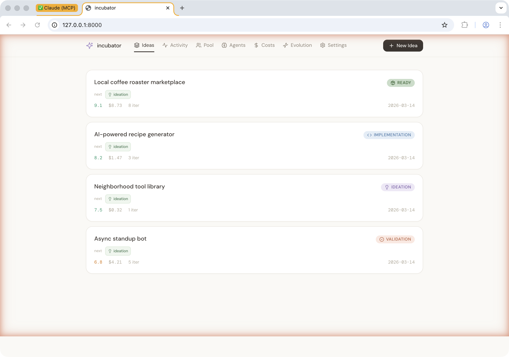
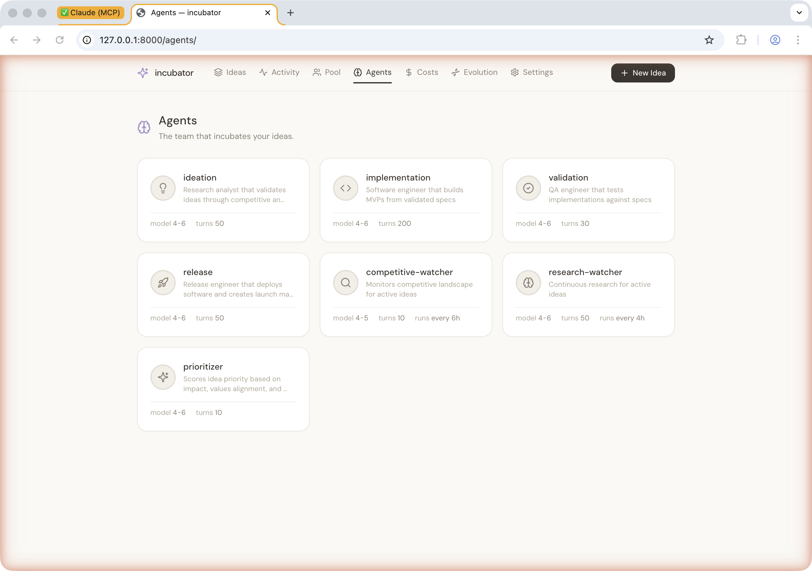

# Trellis

**A structure for growing ideas with agent teams.**

[](LICENSE)
[](https://github.com/sponsors/terraboops)
[](https://github.com/terraboops/trellis)

Trellis is an agentic pipeline platform. You describe an idea. Agent teams
research, build, test, and launch it — running autonomously with human
checkpoints between phases. Custom pipelines, sandboxed execution, plugin
marketplace, TLA+-verified scheduling.



## Install

```bash
brew tap terraboops/tap
brew install trellis
```

Or from source:

```bash
pip install .
```

## Quick start

```bash
trellis init myproject && cd myproject
trellis serve                      # dashboard + agents at localhost:8000
```

Submit your first idea:

```bash
trellis incubate "Cat cafe in Vancouver" -d "A cat cafe targeting remote workers"
```

Or use the web dashboard at `localhost:8000/ideas/new`.

## Philosophy

- **Filesystem-first** — agents coordinate through files on a shared blackboard, not message passing
- **No framework** — agents are Claude sessions with plain-text prompts and MCP tools
- **Blackboard pattern** — context accumulates naturally per idea without a database
- **Human-in-the-loop** — approval gates between phases via Telegram or the web dashboard
- **Agents as plain text** — prompts are Python string constants, edit them directly
- **TLA+-verified scheduling** — the pool scheduler's correctness is formally specified

## Architecture

```
 You ──► idea ──► [ ideation ] ──► [ implementation ] ──► [ validation ] ──► [ release ]
                       │                  │                     │                 │
                       ▼                  ▼                     ▼                 ▼
                  blackboard/ideas/<slug>/  ← shared filesystem state
```

The worker pool schedules agents in time-boxed cycles, rotating across ideas
by priority. Each agent reads what previous agents wrote and adds its own work.

## Features

- **Agent wizard** — describe what an agent should do and LLM generates the config
- **Pipeline templates** — pre-built pipelines for common workflows
- **Plugin marketplace** — extend agents with MCP servers, hooks, and skills
- **Sandboxed execution** — kernel-level isolation via nono (Seatbelt/Landlock)
- **Priority scheduling** — starvation-aware, deadline-pressured, formally verified
- **Feedback routing** — structured feedback with identity tracking and deduplication
- **Knowledge curation** — agents accumulate and self-curate learnings across runs
- **Real-time dashboard** — WebSocket-powered activity feed, cost tracking, pool status



## Agent customization

Each agent lives in `agents/<name>/` with:

- `prompt.py` — the system prompt (a Python string constant)
- `.claude/CLAUDE.md` — project-level instructions
- `knowledge/` — structured Knowledge Objects accumulated across runs

The prompts are plain text. No abstractions, no DSLs. Edit them directly.

## Configuration

Copy `.env.example` to `.env`:

| Variable | Default | Description |
|---|---|---|
| `TELEGRAM_BOT_TOKEN` | — | Telegram bot for notifications + approval |
| `POOL_SIZE` | 3 | Concurrent agent slots |
| `JOB_TIMEOUT_MINUTES` | 60 | Worker pool job timeout |
| `MODEL_TIER_HIGH` | claude-sonnet-4-6 | Model for pipeline agents |
| `MODEL_TIER_LOW` | claude-haiku-4-5 | Model for watchers |

Agent definitions live in `registry.yaml` — models, tool access, turn limits,
and token budgets per agent.

## CLI reference

```
trellis init [DIR]              Scaffold a new project
trellis incubate TITLE          Submit an idea
trellis status IDEA             Show idea status
trellis list                    List all ideas
trellis serve                   Dashboard + worker pool
trellis serve --background      Run as daemon
trellis serve --stop            Stop daemon
trellis run                     Worker pool only (no web UI)
trellis evolve                  Run knowledge curation
trellis migrate                 Apply registry migrations
trellis migrate-knowledge       Convert learnings.md to Knowledge Objects
trellis agent upgrade           Update agents from package defaults
```

## Project layout

```
myproject/
  .trellis              # project marker
  .env                  # config
  registry.yaml         # agent definitions
  agents/               # prompts and knowledge
    ideation/
    implementation/
    validation/
    release/
    artifact-check/     # quality checks across all ideas
    competitive-watcher/ # monitors competitive landscape
    research-watcher/   # tracks relevant research
  blackboard/ideas/     # per-idea shared state
  workspace/            # agent working dirs
```

## Development

```bash
git clone https://github.com/terraboops/trellis.git
pip install -e ".[dev]"
pytest -v
```

## Docs

- [Agent system](docs/agents.md) — customization, creating new agents
- [Architecture](docs/architecture.md) — blackboard pattern, pool scheduler, phase transitions
- [Self-hosting](docs/self-hosting.md) — daemon mode, launchd, systemd, reverse proxy
- [Security](docs/security.md) — sandbox, credential proxy, tool policy, audit, attestation

## Support Trellis

Trellis is built in the open by [terraboops](https://github.com/terraboops).

If Trellis saves you time or sparks ideas, consider:

- **Star this repo** — it helps others discover the project
- **[Sponsor on GitHub](https://github.com/sponsors/terraboops)** or **[Ko-fi](https://ko-fi.com/terraboops)** — supports ongoing development
- **Open an issue** — bugs, ideas, and feedback all welcome
- **Share what you build** — tag `#trellis` or open a discussion

## License

[Apache-2.0](LICENSE)
